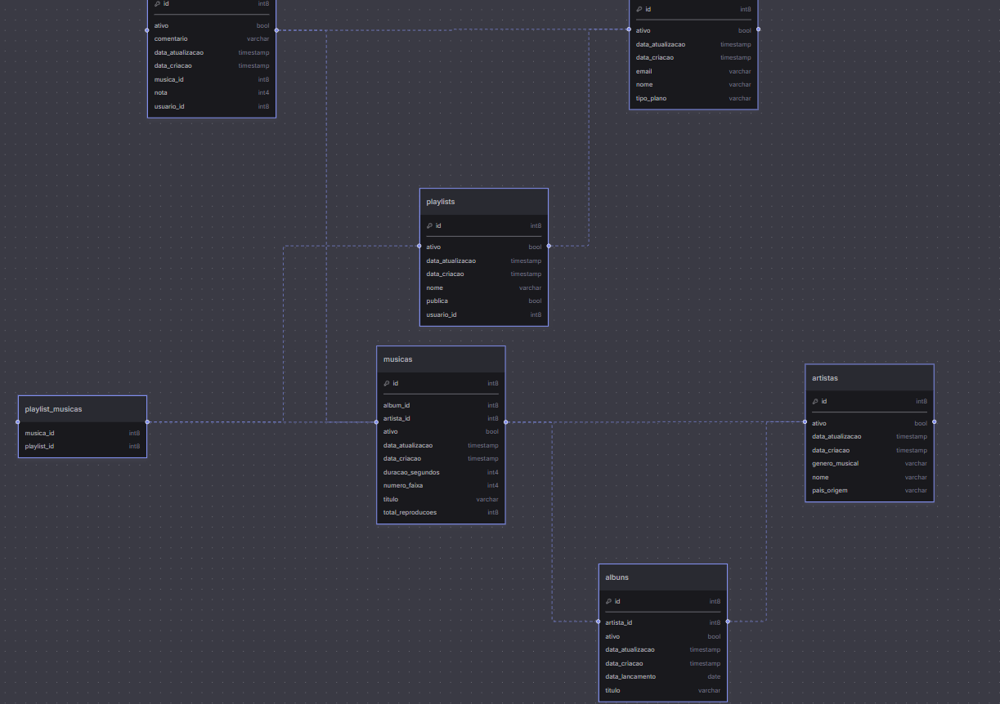

# Mini Spotify: APS 3 de Arquitetura de Objetos
API REST desenvolvida em Spring Boot simulando funcionalidades básicas de uma plataforma de streaming de música, com persistência em banco de dados relacional (PostgreSQL via Aiven).

---

## Sobre o Projeto

A API permite o gerenciamento completo de **usuários, artistas, álbuns, músicas, playlists e avaliações**, com regras de negócio além do CRUD tradicional:

- Reprodução de músicas com contagem de plays
- Ranking das top 10 mais tocadas
- Controle de acesso por dono da playlist
- Exclusões lógicas (soft delete) com bloqueio de operações para entidades inativas

---

##  Diagrama do Banco de Dados

Visualização das tabelas e relacionamentos gerada pela interface do **Aiven**:



---

## Tecnologias Utilizadas

| Tecnologia | Descrição |
|---|---|
| Java 17+ | Linguagem principal |
| Spring Boot 3 | Framework base |
| Spring Data JPA | Camada de persistência |
| PostgreSQL | Banco de dados em produção (Aiven) |
| Lombok | Redução de boilerplate |
| Maven | Gerenciador de dependências |

---

## Entidades

| Entidade | Descrição |
|---|---|
| `Usuario` | Usuário da plataforma (FREE ou PREMIUM) |
| `Artista` | Artista ou banda |
| `Album` | Álbum musical vinculado a um artista |
| `Musica` | Faixa com contagem de reproduções |
| `Playlist` | Coleção de músicas criada por um usuário |
| `Avaliacao` | Avaliação de 1–5 com comentário opcional |

### Relacionamentos

```
Artista  ──< Album   ──< Musica
Usuario  ──< Playlist >──< Musica
Usuario  ──< Avaliacao >── Musica
```

---

## Como Rodar o Projeto

### Pré-requisitos

- Java 17+
- Maven 3.8+
- PostgreSQL

### 1. Clone o repositório

```bash
git clone https://github.com/emilybrtt/aps-spotify-arquitetura-objetos.git
cd aps-spotify-arquitetura-objetos
```

### 2. Configure o banco de dados

#### PostgreSQL (Aiven)

Edite o arquivo `src/main/resources/application.properties`:

```properties
spring.datasource.username=<USUARIO>
spring.datasource.password=<SENHA>
spring.jpa.hibernate.ddl-auto=update
```

As credenciais do Aiven foram enviadas via BlackBoard e também estão no `.zip`

### 3. Execute a aplicação

```bash
./mvnw spring-boot:run
```

A API estará disponível em: **`http://localhost:8080`**

---

## Endpoints

### Artistas`/artistas`
| Método | Rota | Descrição |
|---|---|---|
| POST | `/artistas` | Cadastrar artista |
| GET | `/artistas` | Listar todos (paginado) |
| GET | `/artistas/{id}` | Buscar por ID |
| GET | `/artistas/buscar?nome=` | Buscar por nome |
| PUT | `/artistas/{id}` | Atualizar |
| DELETE | `/artistas/{id}` | Exclusão lógica |

### Álbuns `/albuns`
| Método | Rota | Descrição |
|---|---|---|
| POST | `/albuns` | Cadastrar álbum |
| GET | `/albuns` | Listar todos (paginado) |
| GET | `/albuns/{id}` | Buscar por ID |
| PUT | `/albuns/{id}` | Atualizar |
| DELETE | `/albuns/{id}` | Exclusão lógica |

### Músicas `/musicas`
| Método | Rota | Descrição |
|---|---|---|
| POST | `/musicas` | Cadastrar música |
| GET | `/musicas` | Listar / filtrar por `titulo`, `artistaId`, `albumId` |
| GET | `/musicas/{id}` | Buscar por ID |
| PUT | `/musicas/{id}` | Atualizar |
| DELETE | `/musicas/{id}` | Exclusão lógica |
| POST | `/musicas/{id}/reproduzir` | Reproduzir (header `X-USER-ID` obrigatório) |
| GET | `/musicas/top` | Top músicas mais reproduzidas |

### Usuários `/usuarios`
| Método | Rota | Descrição |
|---|---|---|
| POST | `/usuarios` | Cadastrar usuário |
| GET | `/usuarios` | Listar / filtrar por `nome` |
| GET | `/usuarios/{id}` | Buscar por ID |
| PUT | `/usuarios/{id}` | Atualizar |
| DELETE | `/usuarios/{id}` | Exclusão lógica |

### Playlists `/playlists`
| Método | Rota | Descrição |
|---|---|---|
| POST | `/playlists` | Criar playlist |
| GET | `/playlists` | Listar / filtrar por `nome`, `usuarioId`, `publica` |
| GET | `/playlists/{id}` | Buscar por ID |
| PUT | `/playlists/{id}` | Atualizar |
| DELETE | `/playlists/{id}` | Exclusão lógica |
| POST | `/playlists/{playlistId}/musicas/{musicaId}` | Adicionar música (header `X-USER-ID` obrigatório) |

### Avaliações `/avaliacoes`
| Método | Rota | Descrição |
|---|---|---|
| POST | `/avaliacoes` | Criar avaliação (nota 1–5) |
| GET | `/avaliacoes` | Listar todas (paginado) |
| GET | `/avaliacoes/{id}` | Buscar por ID |
| PUT | `/avaliacoes/{id}` | Atualizar |
| DELETE | `/avaliacoes/{id}` | Exclusão lógica |

### Relatórios `/relatorios`
| Método | Rota | Descrição |
|---|---|---|
| GET | `/relatorios/top-musicas` | Top 10 músicas mais reproduzidas |

---

## Regras de Negócio

| Situação | Comportamento |
|---|---|
| Usuário inativo tenta reproduzir música | `403 Forbidden` |
| Usuário inativo tenta criar playlist | `403 Forbidden` |
| Usuário tenta adicionar música em playlist alheia | `403 Forbidden` |
| Música já presente na playlist | `403 Forbidden` |
| Recurso não encontrado | `404 Not Found` |
| Artista/usuário duplicado | `409 Conflict` |
| Campos obrigatórios ausentes ou inválidos | `400 Bad Request` |

> Todas as exclusões são **lógicas** (campo `ativo = false`). Entidades inativas não aparecem nas listagens e não podem realizar operações.

---

## Coleção Postman

O arquivo `APS Arq. Obj. Spotify.postman_collection.json` está na raiz do projeto.

**Como importar:**
1. Abra o Postman
2. `File → Import`
3. Selecione o arquivo `.json`
4. A variável `{{base_url}}` já está configurada como `http://localhost:8080`

A coleção está organizada em **10 pastas** com fluxo de execução sugerido:

```
01 - Artistas
02 - Álbuns
03 - Músicas (10 músicas)
04 - Usuários
05 - Playlists
06 - Avaliações
07 - Reproduções (popula o ranking)
08 - Relatórios
09 - Error Handling
10 - Limpeza (DELETEs)
```

> Execute as pastas **em ordem**. Artistas e álbuns precisam existir antes das músicas; usuários antes das playlists e avaliações.

